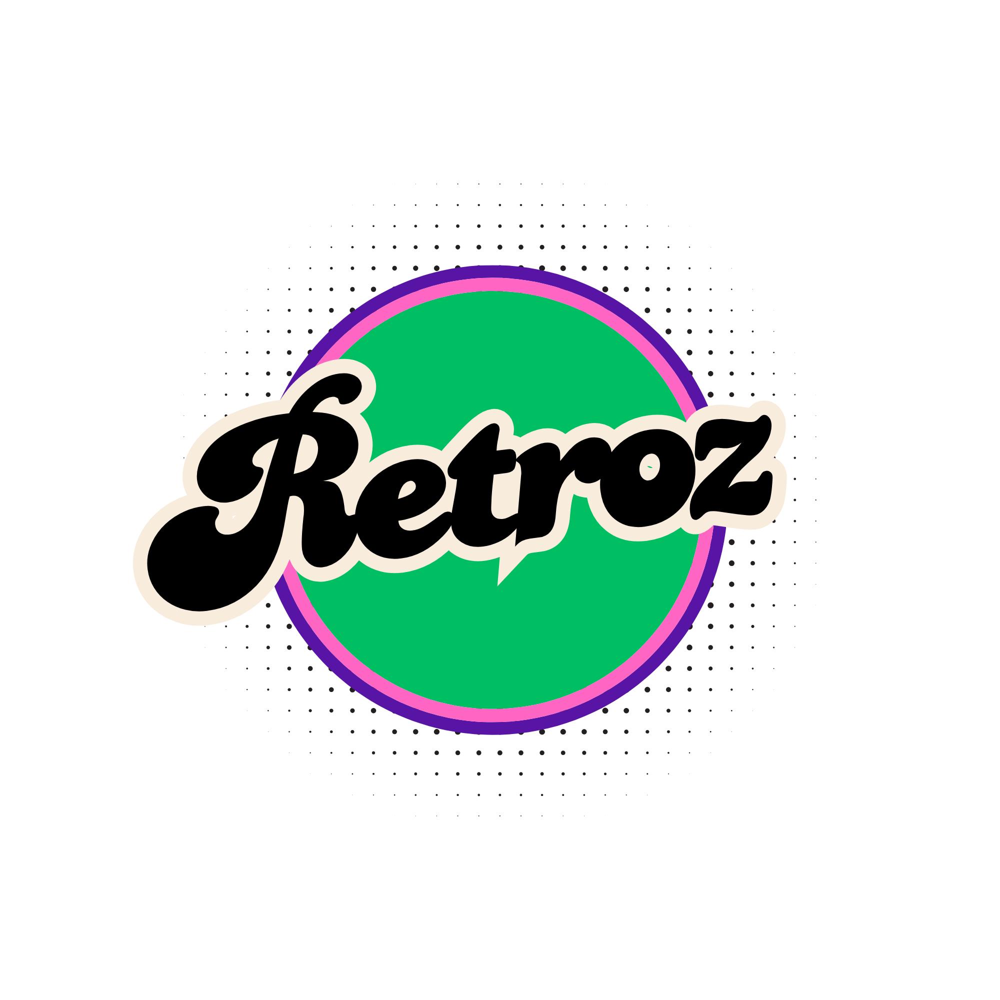
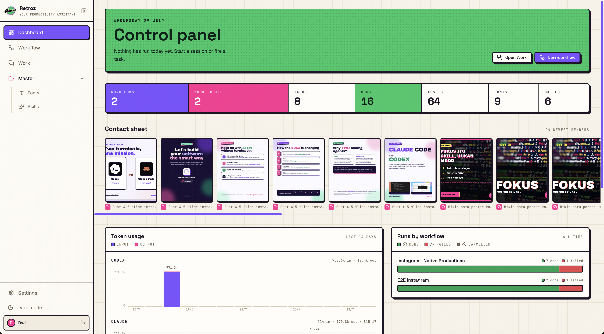
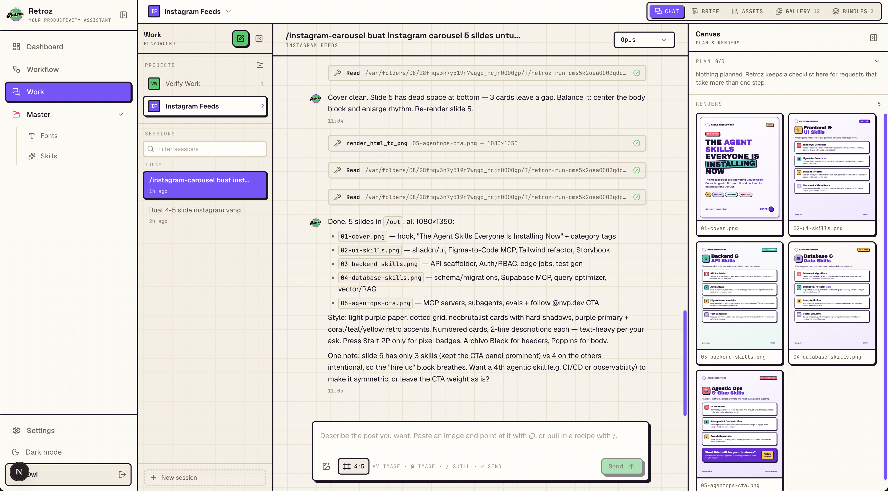
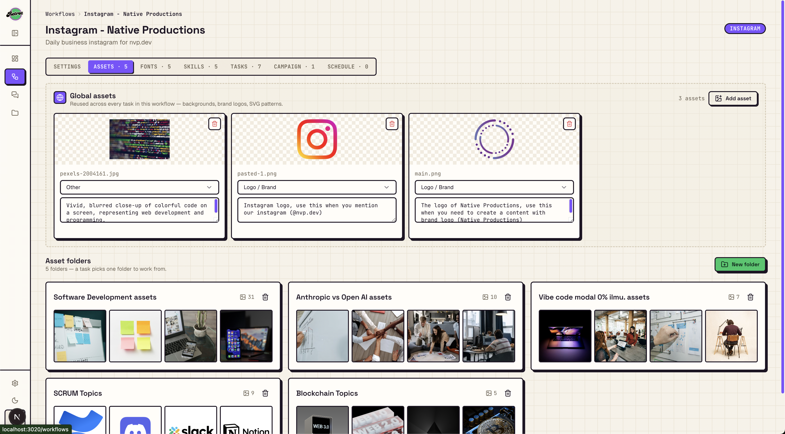
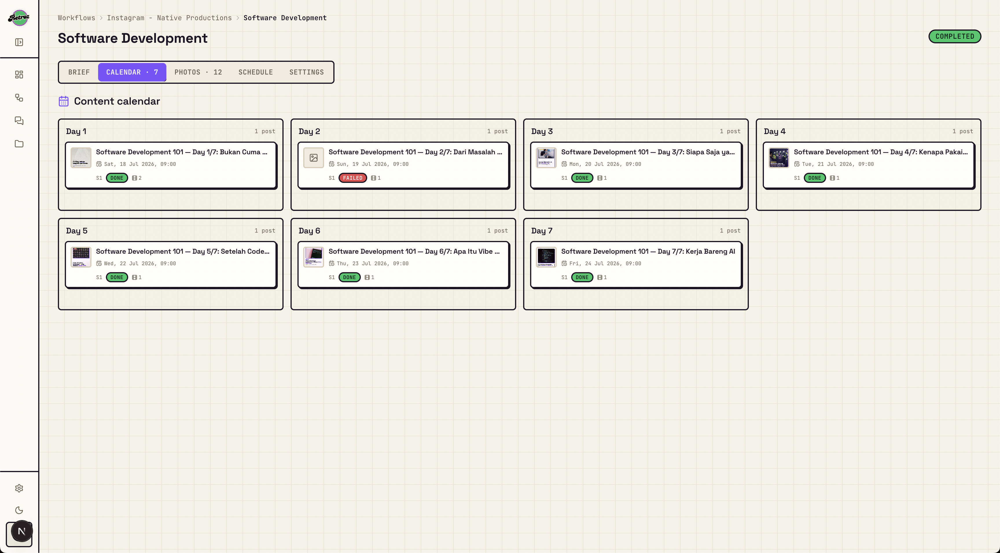

<div align="center">
  
  <p><strong>Your productivity assistant.</strong> A local-only cockpit that turns your coding agent into a content production line.</p>
</div>

---

## What it is

Retroz runs on your machine and drives your **local Claude Code** (or **Codex CLI**)
to produce post-ready Instagram images.

The trick: it does **not** generate pictures with an image model. The agent writes
an HTML/CSS overlay on top of *your own* photos, and Retroz renders that HTML to
PNG with Playwright. So the output is deterministic, on-brand, re-renderable, and
you can fix a typo without rerolling a diffusion model.

Two ways to use it:

- **Work** — a chat playground. Describe the post, paste an image, hit send, get
  PNGs. One page, one session, done in a couple of minutes.
- **Workflows + Campaigns** — the automation side. Define a channel's brand rules
  once, point it at an asset folder, and let a schedule fire tasks daily so the
  content ships without you sitting there.

## The problem it solves

I run several Instagram accounts that post more or less the same *kind* of thing:
explainers, tutorials, tech news. The content changes, the process never does. And
the process is the expensive part:

1. research what's new this week,
2. hunt for a decent photo,
3. open a design tool and lay out 5 slides,
4. repeat tomorrow.

Steps 1–3 are the whole job and none of them are creative after the tenth time.
Retroz takes that loop:

- **Research** — the agent does it as part of the run, using the instruction you wrote once.
- **Images** — you upload a photo bank per workflow; the agent picks from it (plus your brand logos, tagged and described so it knows what each file is).
- **Layout** — the agent writes the HTML, Retroz renders it at 2× retina in the right aspect ratio.
- **Cadence** — a campaign plans N days of posts up front; cron runs them one by one.

What's left for me is picking what to publish. That's it.

> Phase 1 is Instagram-shaped (feed, carousel, story ratios). Video is on the
> roadmap — the schema already leaves room for it.

## Screenshots

**Dashboard** — everything at a glance: counts, the newest renders as a contact
sheet, token spend per engine, and run outcomes per workflow.



**Work** — the fast lane. Chat on the left, live agent activity in the middle,
rendered slides on the canvas at right. Paste an image and point at it with `@`,
pull in a saved recipe with `/`, pick the aspect ratio, send.



**Assets** — per workflow. *Global assets* (logos, backgrounds, patterns) are
reused by every task; *asset folders* are the photo banks a single task draws
from. Every file gets a description so the agent knows what it's looking at.



**Campaign calendar** — a multi-day series planned in one shot. Each day is a
post with its own schedule and status, so a 7-day series is one setup instead of
seven.



**Run viewer** — every run streams live: tool calls, the agent's reasoning, token
cost, and the PNGs filling in as they render. Re-run any run from here.


## How a run works

1. You (or cron) trigger a task → it lands in a serial queue, one agent at a time.
2. Retroz resolves the engine (Claude or Codex), the model, and the fonts, then
   builds the prompt from the workflow instruction + asset descriptions + skills.
3. The agent gets a scoped MCP server with one tool that matters:
   `render_html_to_png`. It reads the photos, writes HTML, calls the tool.
4. The compositor injects `@font-face` for your fonts, renders the page headlessly,
   and screenshots it at 2×.
5. PNGs land in a timestamped folder; every event is persisted and streamed to the
   run viewer over SSE.

## Requirements

- [Bun](https://bun.sh) (this project is bun-only — no npm/yarn/pnpm)
- PostgreSQL 14+ (a local Docker container is fine)
- One of:
  - **Claude Code** logged in (`claude` in a terminal), or an `ANTHROPIC_API_KEY`
  - **Codex CLI** logged in (`~/.codex`)

## Install

```bash
git clone https://github.com/native-productions/retroz.git
cd retroz

bun install                       # deps + prisma generate
bunx playwright install chromium  # the renderer

cp .env.example .env              # fill DATABASE_URL + AUTH_SECRET + seed user
bunx prisma migrate dev           # create the schema
bunx prisma db seed               # seed the single user, settings, starter skill

bun run dev                       # http://localhost:3020
```

Generate an auth secret with `openssl rand -base64 32`. Log in with the
`SEED_USER_EMAIL` / `SEED_USER_PASSWORD` you put in `.env`.

Storage defaults to `./data` on disk. If you'd rather keep assets in an S3-compatible
bucket (Cloudflare R2, MinIO), set `STORAGE_DRIVER="s3"` and fill the `S3_*` block —
`.env.example` documents each field.

### First five minutes

1. **Settings** → pick the engine (Claude or Codex) and the default model.
2. **Workflow** → create one per account or content pillar. Write its instruction:
   brand voice, layout rules, what a slide should never do.
3. **Assets** → upload your logo as a global asset, then make a folder of photos
   and describe each one.
4. **Fonts** → search Google Fonts or upload your own; tag them by mood.
5. **Work** → open a session and ask for a post. Or create a **Task** and hit
   **Run now**. Add a **Schedule** once you trust the output.

### Scripts

| Command | What |
| --- | --- |
| `bun run dev` | Dev server on 3020 (boots the cron scheduler) |
| `bun run build` / `bun run start` | Production build / serve |
| `bun run db:migrate` | Prisma migrate dev |
| `bun run db:seed` | Seed user + settings + starter skill |
| `bun run db:studio` | Prisma Studio |
| `bun run storage:migrate` | Move local `data/` blobs into the object store |

## Stack

Next.js 16 (App Router, Turbopack) · React 19 · TypeScript · Tailwind v4 ·
Prisma 7 + PostgreSQL · Playwright · Auth.js v5 · node-cron · p-queue ·
`@anthropic-ai/claude-agent-sdk` · `@openai/codex-sdk`

## Contributing

PRs welcome. This is a personal tool that grew into something worth sharing, so
the bar is "does it work end to end", not "is it enterprise-grade". The code is
source-available — read the [License](#license) section before you build on it.
By opening a PR you agree your contribution ships under those same terms.

**Before you start**

- Read [`AGENTS.md`](AGENTS.md) — architecture map, conventions, and the gotchas
  that will bite you (Prisma 7 driver adapters, `src/proxy.ts` instead of
  middleware, the `mcp__retroz__*` tool prefix).
- Read [`DESIGN.md`](DESIGN.md) before touching UI. The look is deliberate:
  creative, retro, classy. Not another shadcn dashboard.
- [`PRODUCT.md`](PRODUCT.md) has the scope and the explicit non-goals.

**House rules**

- `bun` only. Dev runs on port **3020**.
- Files are kebab-case and domain-prefixed: `claude-backend.ts`,
  `work-composer.tsx`, `png-compositor.ts`. Never `MyComponent.tsx`.
- Mutations are server actions in `lib/actions/*`. Route handlers only for
  uploads, run triggers, SSE, and media.
- Anything touching Prisma, Playwright, the agent SDKs, or the filesystem is
  Node runtime — never edge.
- Confirmations go through the `useConfirm()` modal. No `window.confirm`.
- Shipped code, comments, and copy stay professional.

**Before opening a PR**

```bash
bunx tsc --noEmit
bun run build
```

Then actually drive the flow you changed: log in, run a task, confirm the PNGs
land and the run viewer streams. Type-checking alone doesn't prove an agent run
still works.

Good first issues: new aspect-ratio presets, extra render targets (LinkedIn,
X cards), better font pairing heuristics, and export helpers.

## License

[PolyForm Shield 1.0.0](LICENSE) © 2026 Dwiyan Putra

Source-available, not OSI open source. **Any purpose is permitted except
competing with Retroz.**

Allowed: run it locally, use it for your own business or your clients' content,
fork it, modify it, redistribute it, build on top of it.

Not allowed: turning Retroz into a product that competes with it — rehosting it
as a SaaS, reselling it, or shipping a rebranded substitute. Free of charge
counts as competing too.

Want to offer it commercially? Open an issue and ask for a separate license.
